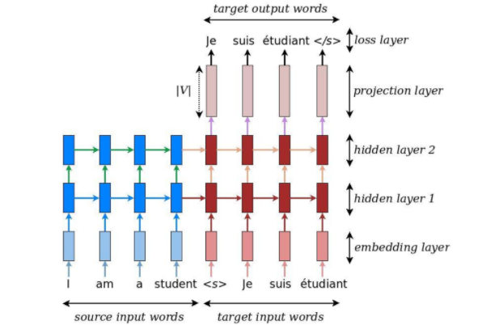
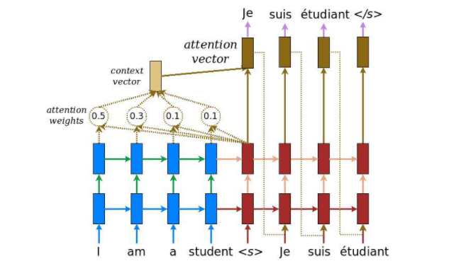

# Neural Machine Translation With Attention From French to English

Figure 1. <b>Heatmap of attention weights</b> 

## Background on Neural Machine Translation
Back in the old days, traditional phrase-based translation systems performed their task by breaking up source sentences into multiple chunks and then translated them phrase-by-phrase. This led to disfluency in the translation outputs and was not quite like how we, humans, translate. We read the entire source sentence, understand its meaning, and then produce a translation. Neural Machine Translation (NMT) mimics that!

Figure 2. <b>Encoder-decoder architecture</b> – example of a general approach for
NMT.

## Background on the Attention Mechanism
Attention models, or attention mechanisms, are input techniques for neural networks that allows the network to focus on specific aspects of a complex input, one at a time until the entire target is decoded. The goal is to avoid the bottleneck probelm in the seq2seq model.

Figure 3. <b>Encoder-decoder with attention architecture</b>
</p
